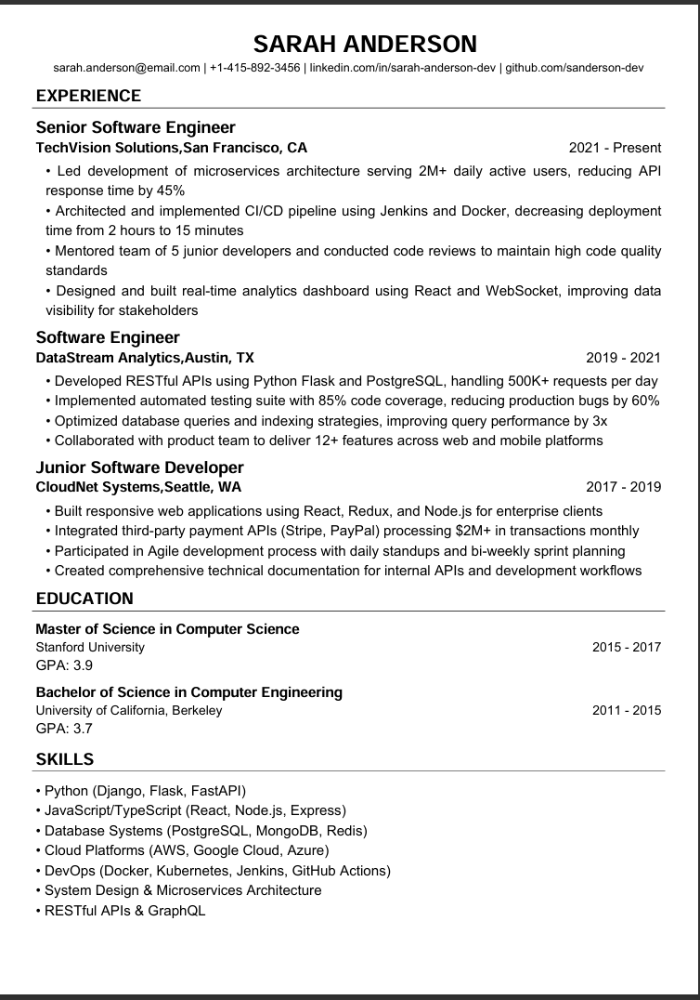

# Simple Resume Builder

A clean and professional resume generator built with Python that creates ATS-friendly PDF resumes. Perfect for software engineers and technical professionals who want a programmatic way to maintain and generate their resumes.

## 🚀 Features

- **Clean, Professional Layout**: Single-column design optimized for readability and ATS compatibility
- **Automatic Text Wrapping**: Long content automatically wraps to fit the page
- **Smart Page Breaks**: Prevents section headings from being orphaned on separate pages
- **Comprehensive Sections**:
  - Contact Information
  - Professional Experience
  - Education
  - Technical Skills
  - Projects
  - Certifications
- **Customizable**: Easy to modify fonts, spacing, and layout
- **Type-Safe**: Uses Python type hints for better code quality

## Sample Output

Here's what your generated resume will look like:



📄 **[View Full PDF Sample](docs/sample.pdf)**

## 📋 Prerequisites

- Python 3.10 or higher (uses modern type hints like `str | None`)
- pip (Python package manager)

## 🛠️ Installation

1. **Clone the repository**
   ```bash
   git clone <repository-url>
   cd resume-builder
   ```

2. **Create a virtual environment** (recommended)
   ```bash
   python -m venv venv
   
   # On Windows
   .\venv\Scripts\activate
   
   # On macOS/Linux
   source venv/bin/activate
   ```

3. **Install dependencies**
   ```bash
   pip install -r requirements.txt
   bash start.sh
   ```
4. **Open Browser & Navigate to below location**
   ```bash
   http://localhost:8000/
   ```
5. 

## 📖 Usage

### Basic Usage

1. **Launch the site**:
   - Update contact details
   - Add your work experience
   - List your education
   - Include your skills
   - Add projects and certifications

2. **Access the API**:
   - Open your browser and navigate to `http://127.0.0.1:8000/docs`
   - You can now use the API to generate your resume


## 📁 Project Structure

```
resume-builder/
├── app.py              # Main application with sample data
├── builder.py          # ResumeBuilder class with PDF generation logic
├── model.py            # Data models for resume sections
├── fonts/
│   └── arial.ttf       # Arial font file (required)
├── requirements.txt    # Python dependencies
├── .gitignore         # Git ignore file
└── README.md          # This file
```

## 🎨 Customization

### Modify Fonts and Sizes

Edit `builder.py` to change font sizes:
```python
self.pdf.set_font("arial", "B", 20)  # Name
self.pdf.set_font("arial", size=14)  # Section headings
self.pdf.set_font("arial", size=12)  # Body text
```

### Adjust Spacing

Modify line spacing in `builder.py`:
```python
self.pdf.ln(3)  # Add 3mm vertical space
```

### Change Section Order

Reorder sections in the `generate_pdf()` method in `builder.py`:
```python
def generate_pdf(self, filename):
    self.pdf.add_page()
    self.user_details()
    self.experience_details()
    self.education_details()
    # ... reorder as needed
```

## 💡 Tips for Best Results

1. **Use the X-Y-Z Formula** for achievements:
   - "Accomplished [X] as measured by [Y], by doing [Z]"
   - Example: "Reduced API latency by 40% (Y) by implementing Redis caching (Z), improving load times for 2M+ users (X)"

2. **Quantify Everything**: Include numbers, percentages, and metrics
3. **Keep it Concise**: Aim for 1-2 pages maximum
4. **Use Action Verbs**: Led, Architected, Designed, Implemented, Optimized
5. **Tailor for Each Role**: Emphasize relevant experience and skills

## 🔧 Troubleshooting

### Font Not Found Error
```
ModuleNotFoundError: No module named 'fpdf'
```
**Solution**: Install dependencies with `pip install -r requirements.txt`

### Arial Font Missing
```
RuntimeError: Cannot open font file
```
**Solution**: Add `arial.ttf` to the `fonts/` directory

### Python Version Error
```
SyntaxError: invalid syntax (type hints)
```
**Solution**: Upgrade to Python 3.10 or higher

## 📦 Dependencies

- **fpdf2** (2.8.5): PDF generation library with Unicode support

## 🤝 Contributing

Contributions are welcome! Feel free to:
- Report bugs
- Suggest new features
- Submit pull requests

## 📄 License

This project is open source and available under the MIT License.

## 🙏 Acknowledgments

- Inspired by professional resume templates from top tech companies
- Built with [fpdf2](https://github.com/py-pdf/fpdf2) library
- Follows ATS-friendly design principles

## 📞 Support

If you encounter any issues or have questions, please open an issue on GitHub.

---

**Made with ❤️ using Python**
